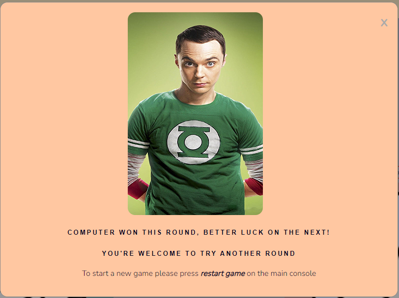
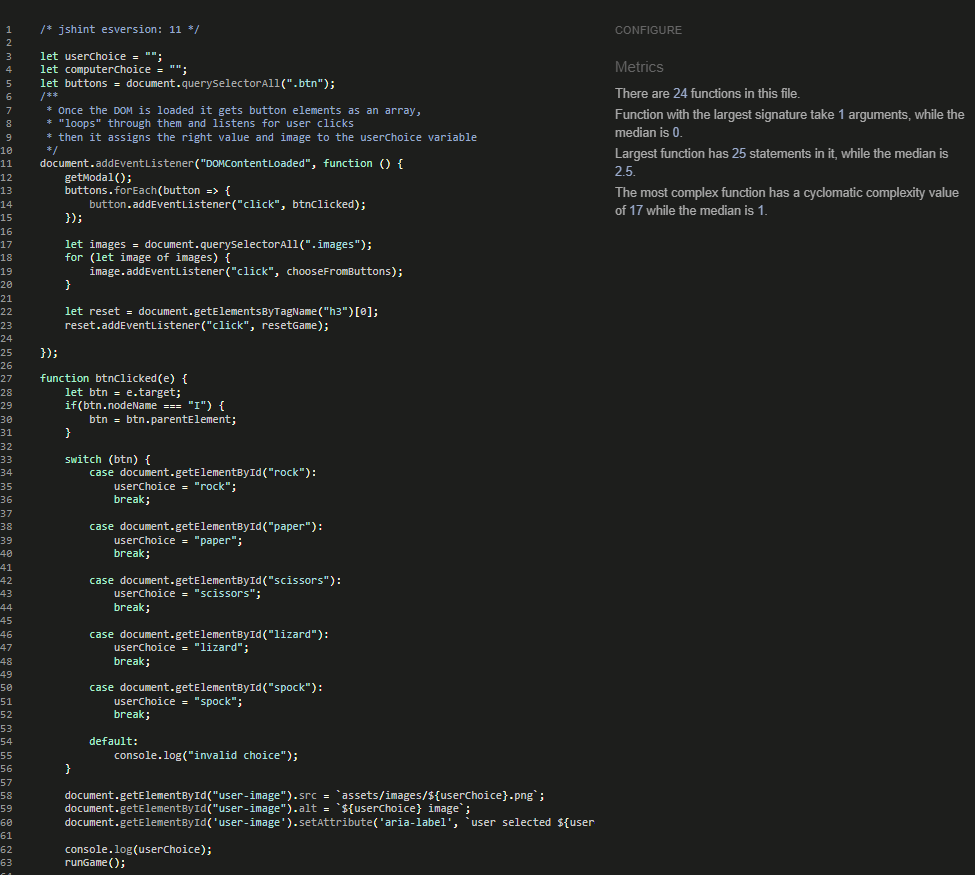
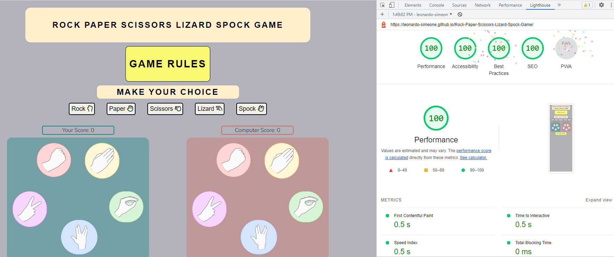

# Rock Paper Scissors Lizard Spock Game

Rock Paper Scissors Lizard Spock game, is a JavaScript based online game that offers users an alternative to the world-known Rock Paper Scissors game. Created by internet pioneer Sam Kass, this game is an improvement of the classic game and adds an extra two choices to make a total of five. The game was popularized by Dr. Sheldon Cooper, a fictional character played by Jim Parsons from the acclaimed tv show The Big Bang Theory. Since the game was first introduced in the show it became quite popular amongst fans and general public.

In this particular version of the game, the user can choose one out of the five options per game to play against the computer, the first one to score ten points wins the round. The game is easy to play and the rules are well explained. To access the games rules the user has to click on the "Game Rules" button available right before the game area. Once the round is finished then the selection buttons are disabled and the user is advised that in order to play another round, they must click/tap on the "Restart Game" button. A score indicator is provided for the user to be able to see in real time both scores.


## UX

### Wireframing

To wireframe the website I used [Whimsical](https://whimsical.com/wireframes). Even though initially I planned on including the game rules via an always visible image, that plan changed given that, when considering screen space as well as a accessibility, I realized that the best course of action was to include the game rules within a modal and in written format so that screen readers would be able to read it.


### Fonts and Colors Selection

* __Fonts.__
    
    * I browsed [heyreliable](https://heyreliable.com/ultimate-google-font-pairings/) google fonts pairings available in their collection and selected number 20 based on the look and mood wanted for the game.
    
    

    * The fonts are clear to read and have a friendly and inviting style. Nothing too serious since the user is there just to have a bit of fun and entertainment.

* __Colors.__

    * For the colors selection, I used the [ColorSpace](https://mycolor.space/) website which provides the option to input any color you want and then it will provide a selection of matching/compatible colors that relate well to that "base" color you selected in the first place.
    * The base color I selected is [#00001D](https://mycolor.space/?hex=%2300001D&sub=1), all the related colors I used, I referenced them accordingly in the css style sheet.    

    

## Features

* __Game Name/Title__

    * The game title is included within the header as the first element in the html document to indicate the user (new or previous), that the site is a game and what the game is about. It is placed within good contrasting background which makes it easy to read.


* __Game Rules Button__

    * The game rules button is very self explanatory, once the user clicks on it a modal opens, in this modal the game's general rules are explained as well as the round top score needed to win it.

    

    * At the end of the rules button modal I included developer credits, within an anchor element I also included the game's GitHub link which opens in a new tab.
    * The button has visual cues to indicate the user that they're hovering over the button by changing color.
    * To exit the rules modal, the user can either click on the X at the top right corner or click anywhere outside of the modal.
    * The execution of this modal is possible thanks to JavaScript and the getModal() function. This function shows the modal when the function is called and allows for it to be closed by either clicking X or clicking anywhere outside of the modal.

    ```js
    function getModal() {

        let modal = document.getElementById("rules-modal");

        // Get the button that opens the modal
        let btn = document.getElementById("btn-rules");

        // Get the <span> element that closes the modal
        let btnClose = document.getElementById("btn-close");

        // When the user clicks the button, open the modal 
        btn.addEventListener("click", modalClicked);
        function modalClicked() {
            modal.style.display = "block";
        }

        // When the user clicks on <span> (x), close the modal
        btnClose.addEventListener("click", modalClosed);
        function modalClosed() {
            modal.style.display = "none";
        }

        // When the user clicks anywhere outside of the modal, close it
        window.addEventListener("click", windowClicked);
        function windowClicked(event) {
            if (event.target == modal) {
                modal.style.display = "none";
            }
        }
    }
    ```


* __Make Your Choice Heading__

    * This heading is an invitation to the user to start playing the game. A call to action for the user to make their choice and start playing.


* __Choice Options Buttons__

    * These buttons will allow the user to select their option from the options available to play against the computer.
    * The button have visual cues that allow the user to know when they're hovering over one of them by changing color.

    

    * Once clicked the button will send the command to JavaScript to run the necessary logic to play the game.
    * When an option is selected, the image corresponding the selected option will appear in the user game area with its respective alt and aria-label attributes.

    

    * Thanks to JavaScript and the document event listener at the start of the JS script, we're able to listen to user click and run the event handler function btnClicked() which assigns the user's choice variable, image, alt and aria-label attributes and calls the runGame() function. The run game function then gets the computer choice by running the getComputerAnswer() function first and then compares the two choices (user's and computer's) to increment the corresponding score.

    ```js
    /* jshint esversion: 11 */

    let userChoice = "";
    let computerChoice = "";
    let buttons = document.querySelectorAll(".btn");
    /**
    * Once the DOM is loaded it gets button elements as an array,
    * "loops" through them and listens for user clicks
    * then it assigns the right value and image to the userChoice variable
    */
    document.addEventListener("DOMContentLoaded", function () {
        getModal();
        buttons.forEach(button => { 
            button.addEventListener("click", btnClicked);
        });

        let images = document.querySelectorAll(".images");
        for (let image of images) {
            image.addEventListener("click", chooseFromButtons);
        }

        let reset = document.getElementsByTagName("h3")[0];
        reset.addEventListener("click", resetGame);

    });

    function btnClicked(e) {
        let btn = e.target;    
        if(btn.nodeName === "I") {
            btn = btn.parentElement;
        }

        switch (btn) {
            case document.getElementById("rock"):
                userChoice = "rock";
                break;
            
            case document.getElementById("paper"):
                userChoice = "paper";
                break;
            
            case document.getElementById("scissors"):
                userChoice = "scissors";
                break;
                    
            case document.getElementById("lizard"):
                userChoice = "lizard";
                break;
        
            case document.getElementById("spock"):
                userChoice = "spock";
                break;

            default:
                console.log("invalid choice");
        }

        document.getElementById("user-image").src = `assets/images/${userChoice}.png`;
        document.getElementById("user-image").alt = `${userChoice} image`;
        document.getElementById('user-image').setAttribute('aria-label', `user selected ${userChoice}`);
                    
        runGame();
            
    }
    ``` 

* __Result Message__

    * This feature shows only when the user has started the game and shows a message indicating the result of the game congratulating them should they win or indicating that the computer has won.

    

    * This functionality is embedded in the runGame() function, which based on the user's and computer's choices comparison result, it will assign and show a corresponding message to the user. This message is fully deleted once the game is reset.

    ```js
    function runGame() {

        getComputerAnswer();

        let userScore = parseInt(document.getElementById("user-score").innerText);
        let computerScore = parseInt(document.getElementById("computer-score").innerText);

        if (userChoice === computerChoice) {            
            document.getElementById("message").innerText = "The game is a tie!";

        } else if (userChoice === "rock" && (computerChoice === "scissors" || computerChoice === "lizard")) {
            document.getElementById("user-score").innerText = ++userScore;            
            document.getElementById("message").innerText = "Congratulations! You win!";
        }

        ...
    }

    ``` 

* __Scoreboards__

    * The score boards are designed to show the user the current round score in real time, each game won will add a point to the winner's score.
    * The score is updated via a functionality embedded in the runGame() function as shown in the code snippet above.
    * Scoreboards are clearly identifiable thanks to their corresponding locations and colors.

    

* __User and Computer Game Areas__

    * Initially, the game areas both contain the same image, in this image the five pictures of the five options are shown.

    
    
    * Once the user selects one of the options by clicking one of the buttons the game starts and the corresponding image to the user selection will be shown in their area, the same will occur for the computer area. All the images will have their corresponding alt and aria-label attributes making it easier for screen readers to read which options have been selected by the parties in play as shown in the code snippet below for the computer choice case.

    ```js
        function getComputerAnswer() {
            computerChoice = Math.floor(Math.random() * 5);

            switch (computerChoice) {
                case 0:
                    computerChoice = "rock";
                    break;
                
                case 1:
                    computerChoice = "paper";
                    break;
                
                case 2:
                    computerChoice = "scissors";
                    break;
                        
                case 3:
                    computerChoice = "lizard";
                    break;
            
                case 4:
                    computerChoice = "spock";
                    break;

                default:
                    console.log("invalid choice");
            }

            document.getElementById("computer-image").src = `assets/images/${computerChoice}.png`;
            document.getElementById("computer-image").alt = `${computerChoice} image`;
            document.getElementById('computer-image').setAttribute('aria-label', `computer selected ${computerChoice}`);
                
        }

    ``` 

    * In case the user gets confused and decides to click on the initial (game-area) image, a modal message has been added that indicates the user that they need to select an option from the options available above in the case of said images being clicked. This is possible thanks to the event listener when the DOM is loaded and the chooseFromButtons() function as shown below. Also a gentle reminder for the user was included in this modal, click on restart game to play again once the round is over.

    ```js
        document.addEventListener("DOMContentLoaded", function () {
            getModal();
            buttons.forEach(button => { 
                button.addEventListener("click", btnClicked);
            });

            let images = document.querySelectorAll(".images");
            for (let image of images) {
                image.addEventListener("click", chooseFromButtons);
            }

            let reset = document.getElementsByTagName("h3")[0];
            reset.addEventListener("click", resetGame);

        });

        /**
        * indicates the user to select their choice from one of the options above,
        * it lets the user know via modal that the game area images are not interactive
        */
        function chooseFromButtons() {    

            let modalWarning = document.getElementById("choose-from-button");

            modalWarning.style.display = "block";

            // Get the <span> element that closes the modal
            let btnClose = document.getElementById("choose-from-btn-close");        

            // When the user clicks on <span> (x), close the modal
            btnClose.addEventListener("click", modalClosed);
            function modalClosed() {
                modalWarning.style.display = "none";
            }

            // When the user clicks anywhere outside of the modal, close it
            window.addEventListener("click", windowClicked);
            function windowClicked(event) {
                if (event.target == modalWarning) {
                    modalWarning.style.display = "none";
                }
            }
        }
    ```

    

* __Restart Game__

    * The Restart Game clickable heading was designed to give the user the option to reset the game before the round is over and to allow the user to reset the game once the round is over.

     

    * An event listener was used to listen to user's click (please see previous code snippet) and a call to the resetGame() function when said event happens (please see previous code snippet).

    ```js
        function resetGame() {
            enableBtns();            
            document.getElementById("user-image").src = "assets/images/rpsls.png";
            document.getElementById("user-image").alt = "Rock-Paper-Scissors-Lizard-Spock";
            document.getElementById("computer-image").src = "assets/images/rpsls.png";
            document.getElementById("computer-image").alt = "Rock-Paper-Scissors-Lizard-Spock";

            document.getElementById("user-score").innerText = 0;
            document.getElementById("computer-score").innerText = 0;

            document.getElementById("message").innerText = "";
        }

    ```

    * Once the function is called the options buttons will be re enabled given they're disabled when either score reaches ten points, also user and computer area images will be set back to the initial images, the scores will be set back to zero, and the game result message will dissapear.

    * The Endgame() function, is the one responsible for trigerring the disableBtns() function which disables the buttons so that the user can't keep playing until the game is restarted. This function runs at the end of the runGame() function, this way, it's able to monitor the scores and execute its logic when needed.

    ```js
        function endGame() {    
            let finalUserScore = parseInt(document.getElementById("user-score").innerText);
            let finalComputerScore = parseInt(document.getElementById("computer-score").innerText);

            if(finalUserScore === 10 && finalComputerScore < 10) {
                document.getElementById("message").innerText = "Well Done! You Have Won this round!";
                disableBtns();
                finalScoreWinModal();        
                
            } else if (finalComputerScore === 10 && finalUserScore < 10) {
                document.getElementById("message").innerText = "Computer won this round";        
                disableBtns();
                finalScoreLoseModal();        
                
            } else {
                console.log("continue playing");
            }
        }

    ```

    * The disabling and enabling of the options buttons and call to action heading, is achieved thanks to adding and removing a CSS class in the buttons elements in HTML, as well as the display style change in the elements to make them dissapear, managing to further reinforce the need to restart the game once the round is over. This way the user has no other choice but to click the rules button or the restart game heading.

    ```js
        function disableBtns() {
            document.getElementById("btn-options").style.display = "none";
            document.getElementById("cta").style.display = "none";
            buttons.forEach(button => {
                button.classList.add("btn-disabled");
            });
        }

        function enableBtns() {
            document.getElementById("btn-options").style.display = "block";
            document.getElementById("cta").style.display = "block";
            buttons.forEach(button => {
                button.classList.remove("btn-disabled");
            });
        }

    ```

    ```css
        .btn-disabled {
            pointer-events: none;
        }
    ```

     
    
* __End Game Win and Lose Modals__

    * Once the 10 points mark is reached by either party, a modal is trigerred which delivers a message depending on who the winner was. This message will explicitly indicate the user that the round is over and should they want to keep playing, they need to restart the game.
    * The finalScoreWinModal() function or the finalScoreLoseModal() function will be called in the endGame() function, depending on the round's result, showing then the corresponding HTML modal div.

    ```js
        
    function finalScoreWinModal() {    

        let finalModal = document.getElementById("final-score-win-modal");

        finalModal.style.display = "block";

        // Get the <span> element that closes the modal
        let btnClose = document.getElementById("final-score-win-close");        

        // When the user clicks on <span> (x), close the modal
        btnClose.addEventListener("click", modalClosed);
        function modalClosed() {
            finalModal.style.display = "none";
        };

        // When the user clicks anywhere outside of the modal, close it
        window.addEventListener("click", windowClicked);
        function windowClicked(event) {
            if (event.target == finalModal) {
                finalModal.style.display = "none";
            }
        };
    }

    ```

     

    ```js

    function finalScoreLoseModal() {    

        let finalModal = document.getElementById("final-score-lose-modal");

        finalModal.style.display = "block";

        // Get the <span> element that closes the modal
        let btnClose = document.getElementById("final-score-lose-close");        

        // When the user clicks on <span> (x), close the modal
        btnClose.addEventListener("click", modalClosed);
        function modalClosed() {
            finalModal.style.display = "none";
        }

        // When the user clicks anywhere outside of the modal, close it
        window.addEventListener("click", windowClicked);
        function windowClicked(event) {
            if (event.target == finalModal) {
                finalModal.style.display = "none";
            }
        }
    }

    ```

    

## Tools and Technologies

* HTML: It was used to structure the content of the game both semantically and visually.
* CSS: It was used for responsiveness, styling and layouts.
* JavaScript: It was used to code the logic and interactivity behind the game.
* [CSS Flexbox](https://developer.mozilla.org/en-US/docs/Learn/CSS/CSS_layout/Flexbox): It was used for improved responsiveness and more control while positioning elements instead of floats.
* [Git](https://git-scm.com/): It was used for version control throughout the project developement process.
* [GitHub](https://github.com/): It was used as a secure cloud-based files storage for my code and repositories in general. Also as a deployment platform via GitHub Pages.
* [Gitpod](https://www.gitpod.io/): It was used as a cloud-based IDE to develope the site.
* [Whimsical](https://whimsical.com/wireframes): It was used to wireframe the initial idea/mock-up of the project.
* [Adobe Photoshop](https://www.adobe.com/ie/products/photoshop.html): It was used to resize, cut and color images as well as framing several images together into one.

## Testing

### Responsiveness

* I manually tested responsiveness with the help of devtools in Chrome, I checked multiple times that the game responds well regardless of the size and that no element is broken by size change. I tested respponsiveness starting at 320px wide to 1470px wide and beyond. All features look OK including, headings, images, buttons and modals.


* Also the [Am I Responsive](https://ui.dev/amiresponsive?url=https://leonardo-simeone.github.io/Rock-Paper-Scissors-Lizard-Spock-Game/) website was used to test responsiveness.


### Functionality

* I tested that all the functionality in the game works as intended. By making use of the console.log() function (which I removed previous to project submission), I managed to follow the code during execution, allowing me to debug if needed and to confirm that the functions were doing what they were built to do.
* The buttons were inputting the correct user choice, the getComputerAnswer() function was working as intended, the game result message was being printed correctly and the end game modal was triggering as it should.


* I also made sure that when the user clicks on the user game area image as well as the computer game area image, the alert modal message is displayed.


### Browsers Compatibility

* I tested compatibility and functionality across different browsers. I used Chrome, Edge and Firefox, and in every single one of them the game works and responds well.


### Bugs

* The first issue I encountered was the excessive space the rules image was occupying, to resolve this issue I researched online and I found a tool that allowed me to put the rules in without taking no space on the main screen, a modal. I found the modal and how to use it in [w3schools.com.com](https://www.w3schools.com/howto/howto_css_modals.asp). Once I understood how it works, I took this modal example and adapted it to my needs. I also used the modal to prompt the user with an end game message.

    ```js

    function getModal() {

        let modal = document.getElementById("rules-modal");

        // Get the button that opens the modal
        let btn = document.getElementById("btn-rules");

        // Get the <span> element that closes the modal
        let btnClose = document.getElementById("btn-close");

        // When the user clicks the button, open the modal 
        btn.addEventListener("click", modalClicked);
        function modalClicked() {
            modal.style.display = "block";
        }

        // When the user clicks on <span> (x), close the modal
        btnClose.addEventListener("click", modalClosed);
        function modalClosed() {
            modal.style.display = "none";
        }

        // When the user clicks anywhere outside of the modal, close it
        window.addEventListener("click", windowClicked);
        function windowClicked(event) {
            if (event.target == modal) {
                modal.style.display = "none";
            }
        }
    }


    ```

* Another issue I found was during HTML document check. The checker indicated that I had a h2 (heading) inside a button and that is not allowed, also that I had a duplicate id which is also not allowed. To resolve the errors I removed the h2 (heading) inside the button and made the text bold to compensate for the font weight. As regards of the duplicate id, I changed the ids for classes and adjusted accordingly in CSS.


```css
.final-score-message h4 {
    font-size: small;    
}
```

* During JavaScript document check, I found that the checker was indicating that the variables I declared as well as the arrow functions used were from ES6 version, basically they're a from a new version of JS and the checker was having trouble recognizing them. With the help of my mentor, I added the "js hint" comment that allowed the checker to recognize the new version syntax used.


* The last error I found was that when the buttons were clicked, sometimes they worked OK (selected the correct option) and sometimes they didn't, instead of selecting the correct option, they just selected spock regardless of the button pressed. Once more with the help of my mentor we found out that the problem was that when an icon (inside the button) was pressed, it would automatically go to the spock option as it was reading the icon as a different element from the button altogether. To resolve the issue I forced the function to read the icons as if they were the button they are in.


```js
let btn = e.target;    
if(btn.nodeName === "I") {
        btn = btn.parentElement;
}
```

### HTML, CSS, JavaScript and Accessibility Validators Testing

* I used the [official W3C Markup Validation Service](https://validator.w3.org/#validate_by_input) on the html file and no errors were found.


* I used the [official W3C Jigsaw validator](https://jigsaw.w3.org/css-validator/#validate_by_input) on the css file and no issues were found.


* I ran the JavaScript file through the [official JShint validator](https://jshint.com/) and no errors were found.



* I used the lighthouse tool in devtools for mobile and desktop to test color contrast and accessibility and they were marked 100%.

#### Mobile:


#### Desktop:



## Deployment

* I deployed the website using GitHub pages. The steps to do so, were the following:
    * In the GitHub repository project menu, click on the cog wheel marked as Settings.
    * Once in settings, on the left-hand side of the screen click on the Pages tab.
    * In the Pages tab select "Deploy from a branch" in the drop-down menu from "Source".
    * Right under the Source dropdown menu there is the "Branch" menu, from it select "Main" and "/(root)".
    * Click on save and refresh the page after a few minutes to give GitHub time to process the deployment.
    * At the top you will see the generated link to "Visit site" already deployed.

    
    
    * The link to visit the deployed website: [Rock Paper Scissors Lizard Spock Game](https://leonardo-simeone.github.io/Rock-Paper-Scissors-Lizard-Spock-Game/index.html)

### Local Deployment

In order to make a local copy of this project, you can clone it. In your IDE Terminal, type the following command to clone my repository:

* `git clone https://github.com/leonardo-simeone/Rock-Paper-Scissors-Lizard-Spock-Game.git`

Alternatively, if using Gitpod, you can click below to create your own workspace using this repository.

[](https://gitpod.io/#https://github.com/leonardo-simeone/Rock-Paper-Scissors-Lizard-Spock-Game)

## Credits

__Content__

* The knowledge applied in the use of flexbox, I learned from [developer.mozilla.org](https://developer.mozilla.org/en-US/docs/Learn/CSS/CSS_layout/Flexbox). By using flexbox I was able to position elements in my layout a lot easier than with float.
* The original code to create modals I took from [w3schools.com](https://www.w3schools.com/howto/howto_css_modals.asp) which I modified later to meet my needs.
* The icons I used in the buttons and the modals I took from [Fontawesome](https://fontawesome.com/search?q=game&o=r&m=free).
* The inspiration for the game I took from The Big Bang Theory show [The Big Bang Theory tv show](https://www.youtube.com/watch?v=_PUEoDYpUyQ&t=25s).
* I used several Slack channels to find out information on different topics. 

__Media__

* To wireframe the project, I used [Whimsical](https://whimsical.com/wireframes).
* To choose fonts pairing, I used [Heyreliable](https://heyreliable.com/ultimate-google-font-pairings/).
* To choose the colors for the site, I used [ColorSpace](https://mycolor.space/?hex=00001D&sub=1).
* The image I used as the main game area image, I took from [veerasundar.com](https://veerasundar.com/rock-paper-scissor-lizard-spoc/).
* The individual images I used for each one of the options, I took from [this repository](https://repository-images.githubusercontent.com/194540172/75fd1300-9b66-11e9-8569-0768e6667775). I cut and colored each image.
* I used [Adobe Photoshop](https://www.adobe.com/ie/products/photoshop.html) to resize, cut, color and group images.